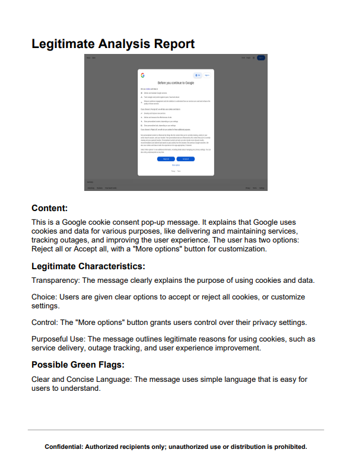

# GEN-AI-Automated-Reporting-for-Phishing-Detection
This project uses generative AI to assess websites as phishing or legitimate. It generates PDF reports by getting a screenshot of web using API and Provides report with green flags and red flags, offering insights into site trustworthiness, impact assessment, and more. Perfect for quick, automated analysis of URL security.

## Deployment

1. To deploy this project download the repository
2. Create a python enviornment to run the project using 
```bash
   python3 -m venv myenv 
```
3. Install Python Package Requirements
```bash
  pip3 install -r requirements.txt
```
4. Now the whole GEN-AI is Settled up, Either You can Integrate it with your Website or Phishing URL detection System[ Any ML Model ].
5. Here is an illustration of the report generated:

   

I have Provided the Sample Reports for legitimate and phishing in the repository too. 
